# Zangetsu Studio

Fan-made anime universes, each told as one scroll-driven story. The first is **Bleach**: Ichigo's arc in seven chapters, from a borrowed blade to the Final Getsuga, built entirely from Tite Kubo's own chapter-cover art run through a single ink pass. Every scroll scene is a story beat, and the prologue pays off six chapters later. Dragon Ball, Naruto, One Piece and Jujutsu Kaisen are on the drawing board.

[](https://developer.mozilla.org/docs/Web/HTML)
[](https://developer.mozilla.org/docs/Web/CSS)
[](https://developer.mozilla.org/docs/Web/JavaScript)
[](https://gsap.com/)
[](https://lenis.darkroom.engineering/)
[](https://sayandeep1013.github.io/ZangetsuStudio/)
[](LICENSE)

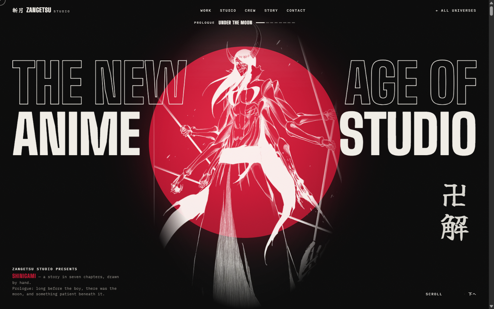

No framework, no build step, no dependencies to install. Serve the folder and it runs.

**Live:** [sayandeep1013.github.io/ZangetsuStudio](https://sayandeep1013.github.io/ZangetsuStudio/)

---

## Screenshots

| Home — pick a universe | The universe accordion |
|---|---|
| 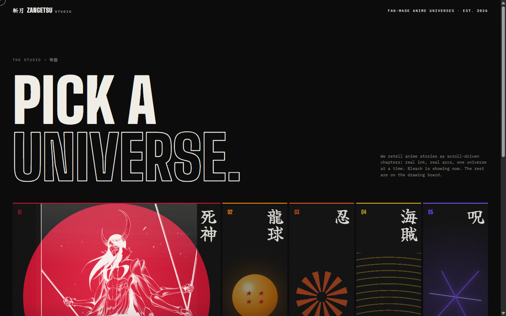 | 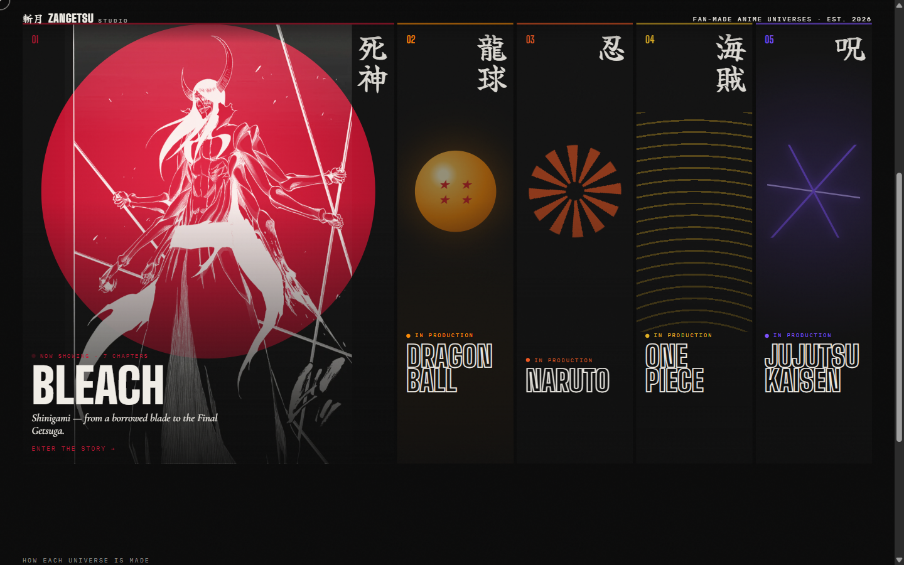 |

| Ch. 01 — the blade falls, the Hollow surfaces | Ch. 02 — the slash cuts the page in two |
|---|---|
| 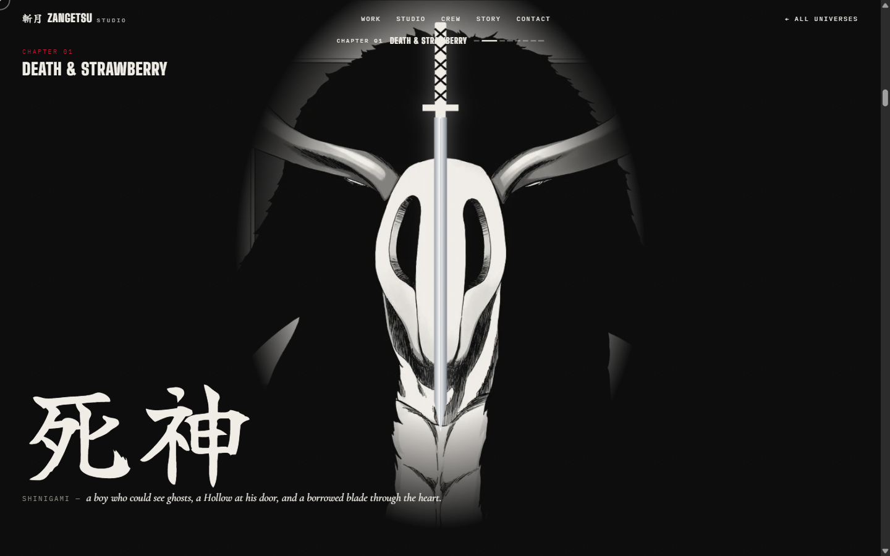 | 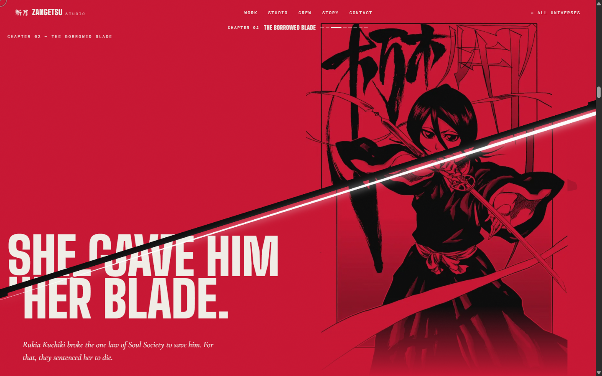 |

| Ch. 03 — Kenpachi only came to fight | Ch. 04 — the Gotei Thirteen deck fans out |
|---|---|
| 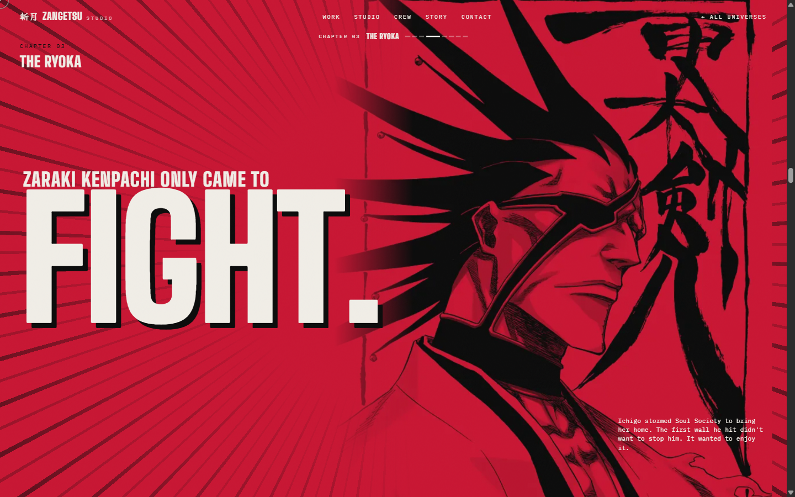 | 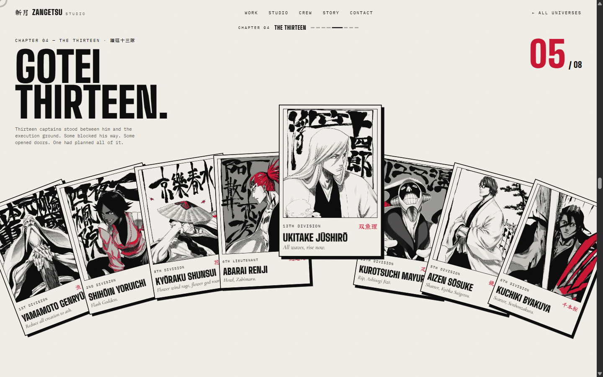 |

| Ch. 04 — one captain gets stamped | Ch. 05 — the torn edge drags the Hollow across |
|---|---|
| 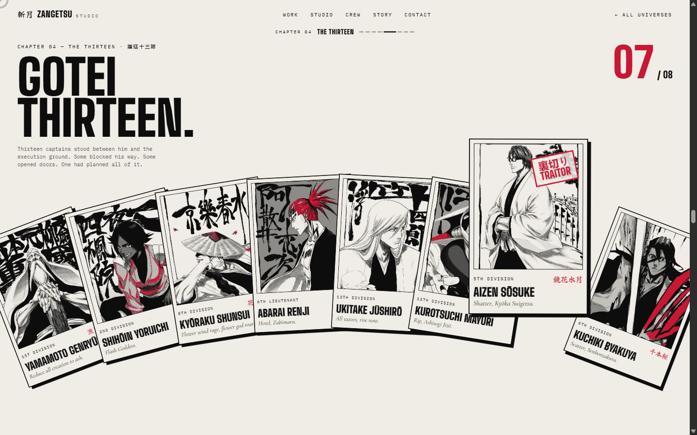 | 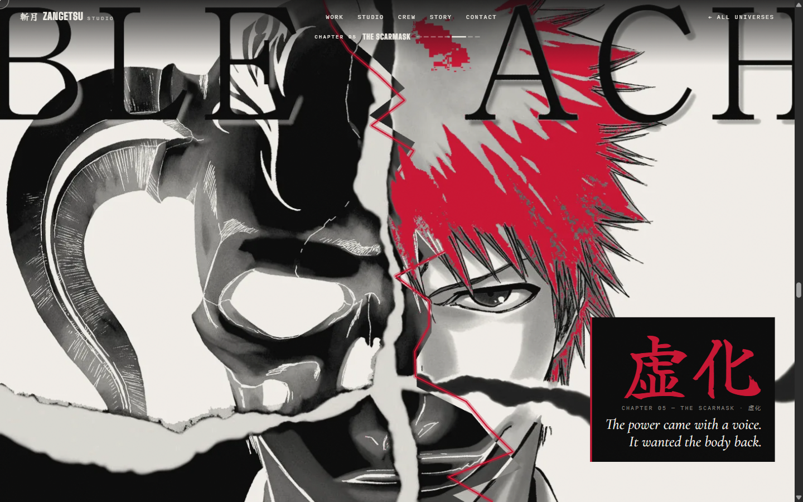 |

| Ch. 06 — the halves slam together | Ch. 07 — the crescent tears across |
|---|---|
| 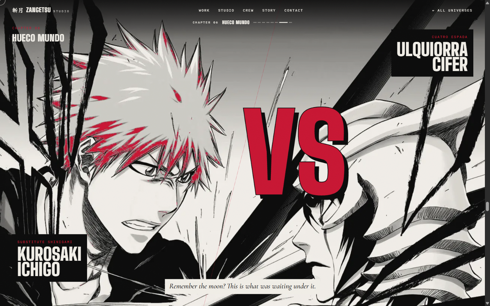 | 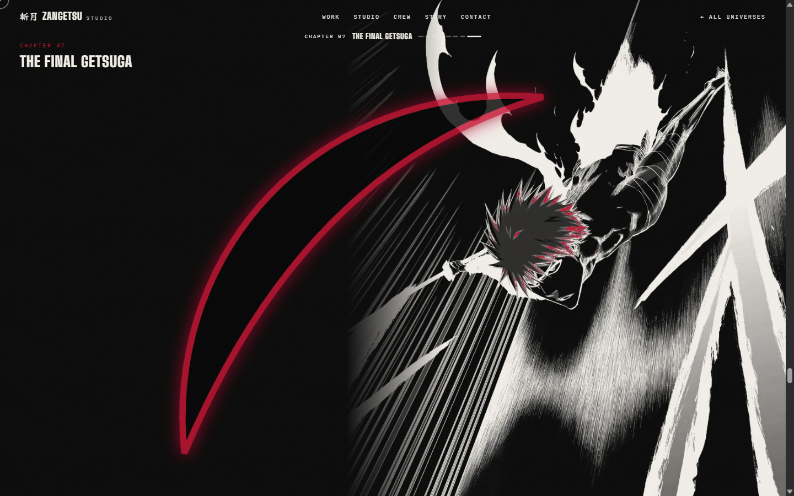 |

| Ch. 07 — 月牙天衝 | The storyboard |
|---|---|
| 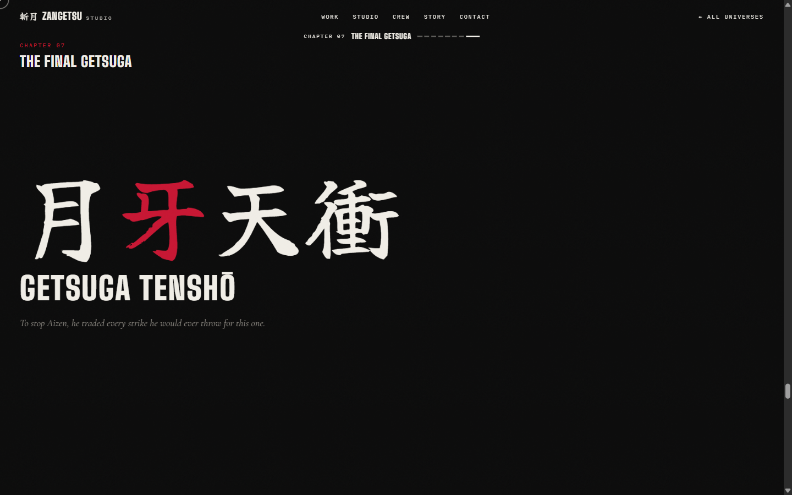 | 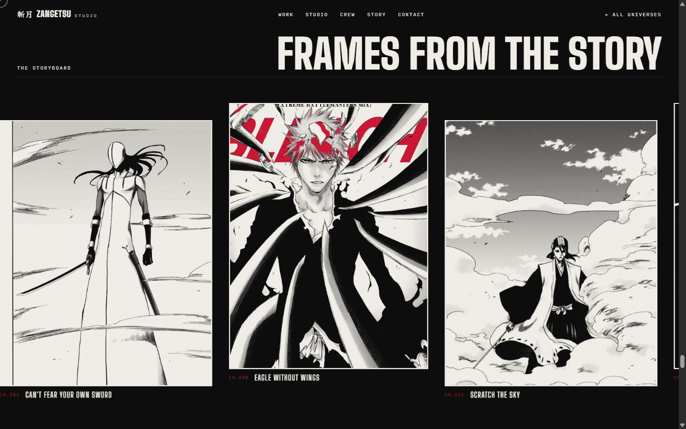 |

| Epilogue — who drew it | A universe still in production |
|---|---|
| 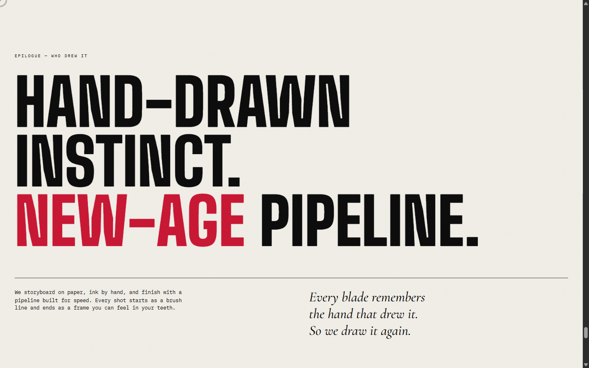 | 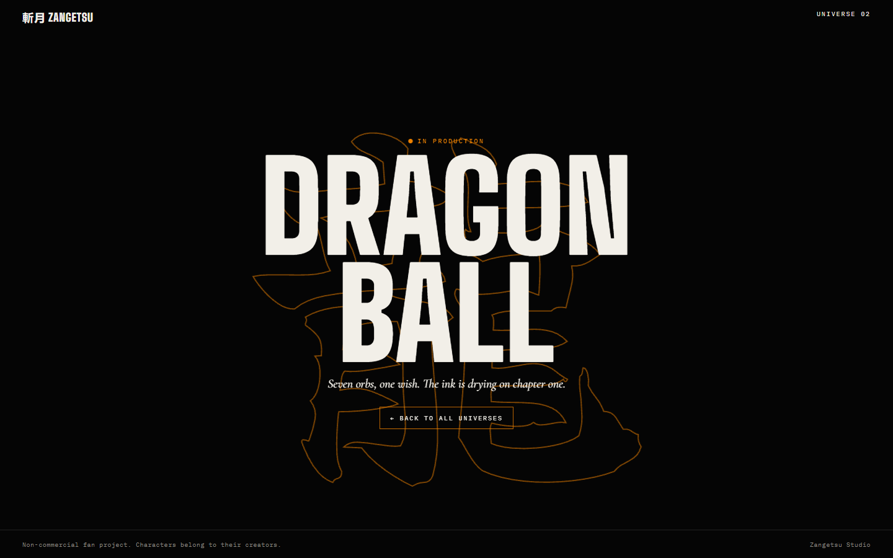 |

**On a phone**

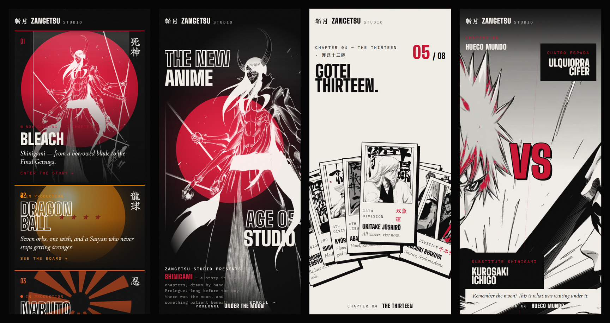

---

## How it works

- **Scroll is the camera.** Each chapter is a full-screen section pinned by ScrollTrigger for two to three screens of scroll. One scrubbed timeline per chapter runs its beat: the fall, the cut, the slam, the reveal. Lenis smooths the wheel and feeds ScrollTrigger from GSAP's ticker, so both run on one clock.
- **The art is real ink, not drawn in code.** Every figure is a Kubo chapter cover from the [Bleach Wiki](https://bleach.fandom.com), passed through `tools/ink.py`: greyscale, levels crushed to solid black and paper, and saturated reds kept as the one brand red. Line-heavy art can be flipped to white-on-black for the dark chapters.
- **Blends are baked, not live.** Art that sits on flat red is rendered onto red by `ink.py --paper`, so no full-screen `mix-blend-mode` has to be recomposited every frame.
- **The story drives the page.** Each chapter section carries `data-chapter` and `data-title`, and a HUD under the nav reads them as you pass. The chapters, their art and their scroll moments are mapped in [`bleach/STORY.md`](bleach/STORY.md).
- **Slots for motion.** Any `data-scene` can take a video or a still: `tools/make-frames.mjs` turns a clip into WebP frames that scrub on a canvas with the chapter's pin, and the drawn placeholder hides itself.

```js
// a chapter is one pinned, scrubbed timeline
gsap.timeline({ scrollTrigger: { trigger: '#versus', start: 'top top', end: '+=180%', scrub: 1, pin: true } })
  .to('.vs-half.l, .vs-half.r', { xPercent: 0, duration: 0.6, ease: 'power4.in' }, 0)   // slam
  .fromTo('.vs-flash', { opacity: 0 }, { opacity: 1, duration: 0.05 }, 0.6)            // impact frame
  .fromTo('.vs-word span', { scale: 4, opacity: 0 }, { scale: 1, opacity: 1, stagger: 0.1 }, 0.7);
```

---

## Bleach — *Shinigami*, in seven chapters

| # | Chapter | Art | Beat | Scroll moment |
|---|---|---|---|---|
| — | Prologue: Under the Moon | ch. 311 Ulquiorra, inverted | Something patient waits under the moon | The moon swells and swallows the screen |
| 01 | Death & Strawberry | ch. 336 Hollow | A Hollow at the door, a borrowed blade | The sword falls, impact, the mask surfaces, 死神 |
| 02 | The Borrowed Blade | ch. 266 Rukia | She gives him her power and is sentenced for it | One slash cuts the page in two |
| 03 | The Ryoka | ch. 104 Kenpachi | He storms Soul Society; Kenpachi only came to fight | FIGHT. slams in, impact-frame flashes, a diagonal wipe |
| 04 | The Thirteen | ch. 156–166, eight captains | Thirteen captains in his way, and one planned it all | The deck fans out, each captain steps forward, Aizen is stamped TRAITOR |
| 05 | The Scarmask | ch. 289 | The power comes with a voice that wants the body back | A torn red edge drags the inverted Hollow across his face |
| 06 | Hueco Mundo | ch. 340 Ichigo vs Ulquiorra | The thing under the prologue's moon | The halves slam together, flash, VS, shake |
| 07 | The Final Getsuga | ch. 377, inverted | He trades every future strike for one | The crescent tears across, blackout, 月牙天衝 |
| — | Storyboard, Epilogue | gallery, studio | Frames from the story; who drew it | A horizontal run, line reveals, hover previews |

### Universes

| # | Universe | Folder | Accent | Status |
|---|---|---|---|---|
| 01 | Bleach | [`bleach/`](bleach/) | `#C8102E` | Live, 7 chapters |
| 02 | Dragon Ball | [`dragonball/`](dragonball/) | `#FF8A00` | In production |
| 03 | Naruto | [`naruto/`](naruto/) | `#F2541B` | In production |
| 04 | One Piece | [`onepiece/`](onepiece/) | `#E2B01E` | In production |
| 05 | Jujutsu Kaisen | [`jujutsukaisen/`](jujutsukaisen/) | `#7B4DFF` | In production |

---

## Design system

| Token | Value |
|---|---|
| Ink | `#050505` |
| Paper | `#F2EFE8` |
| Red (Bleach accent) | `#C8102E`, deep `#8F0A1F` |
| Display | Big Shoulders Display 900, condensed and sharp like Bleach's title cards |
| Brush kanji | Yuji Syuku |
| Narration | Cormorant Garamond italic, for Kubo-style poem lines |
| Mono | IBM Plex Mono, for labels, chapter tags and the HUD |
| Texture | One animated SVG-noise grain over everything |
| Easing | `power4` for slams and reveals, `expo.out` for arrivals, linear scrub for anything tied to scroll |

Each universe swaps the accent and the art. The ink, paper and type stay, so the studio reads as one house.

---

## Stack

| Layer | Technology |
| --- | --- |
| Markup | Static HTML: one home page, one page per universe |
| Styling | Hand-written CSS per universe, custom properties for tokens |
| Motion | GSAP 3.12.5 + ScrollTrigger, Lenis 1.1.13 (vendored in `shared/vendor/`) |
| Effects | Inline SVG (crescent, slash, torn edge), one canvas for reiatsu particles |
| Art pipeline | Python + numpy + Pillow (`ink.py`), Node + ffmpeg (`make-frames.mjs`) |
| Images | WebP, 640–1600px, decoded in idle time after load |
| Hosting | GitHub Pages via GitHub Actions |

---

## Project structure

```txt
index.html                universe picker (home)
shared/
  home.css, home.js       the hub: accordion, intro, colour-matched exit wipe
  soon.css                the coming-soon page every unbuilt universe uses
  vendor/                 gsap, ScrollTrigger, lenis
bleach/
  index.html              the seven chapters
  css/style.css           the whole Bleach design system
  js/main.js              one pinned timeline per chapter, HUD, marquees, media slots
  assets/art/*.webp       ink-treated art, the only images the site loads
  assets/src/             the original covers ink.py starts from (not deployed)
  assets/scenes.json      optional video / still slots
  STORY.md                chapter ↔ section ↔ art ↔ scroll moment
dragonball/ naruto/ onepiece/ jujutsukaisen/   coming soon
tools/
  ink.py                  the ink treatment
  make-frames.mjs         clip → scrubbed WebP frames, or still → slot image
screenshots/readme/       the images in this file
.github/workflows/        Pages deploy
```

### Starting a new universe

1. Copy `bleach/` over its folder. That replaces the coming-soon page.
2. Write its `STORY.md` first: a prologue, the chapters, and the payoff.
3. Ink its art with `tools/ink.py`, set the accent in `css/style.css`, and rewrite the sections and timelines.
4. Flip its card on the home page from *In production* to live.

---

## Local setup

Any static server works. There is nothing to build.

```bash
python -m http.server 5173    # → http://localhost:5173
```

The pages fetch `assets/scenes.json`, so serve the folder rather than opening the files from disk.

Asset tools:

```bash
python tools/ink.py bleach/assets/src/ch311.png bleach/assets/art/hero.webp --crop 0.05,0.01,0.97,0.9 --invert
python tools/ink.py bleach/assets/src/ch266.png bleach/assets/art/frame.webp --crop 0,0.09,1,1 --paper "#c8102e"
node tools/make-frames.mjs clip.mp4 hero --universe bleach    # video → scroll-scrubbed frames
```

---

## Notes

- **Performance.** The chapters after Hueco Mundo used to stutter on first view. A trace found the two kanji marquees reading `scrollWidth` inside the frame loop, forcing a layout every frame and making Lenis and ScrollTrigger's own reads expensive. Width is now measured once, off-screen marquees don't tick, and forced-reflow time fell from 353ms to 134ms over the same scroll. The crescent, which scales 23× through an SVG glow filter, sits on its own layer, so it's rasterised once and then just scaled. Blur reveals became scale reveals, and the torn edge's per-frame `drop-shadow` became a second, wider polyline. First-view frame rate after the fixes: Hueco Mundo 118 → 143fps with no slow frames, the Final Getsuga 122 → 142fps.
- **Inverting ink.** Only line-heavy art on white survives inversion. Ulquiorra's winged "The Wrath" cover turned into a white silhouette, because its large black masses became large white ones, so the hero uses ch. 311 instead.
- **Clipped display type.** Masked headline lines (`overflow: hidden` for the rise-in) clip the top of condensed caps at tight line-heights. Each `.line` carries `padding-top: .14em` with a matching negative margin, so nothing is cut and the rhythm doesn't change.
- **Pins and `from()`.** A `from()` tween inside a timeline with `invalidateOnRefresh` re-records its hidden start state as the end state after a resize. Chapter timelines use explicit `fromTo()`.

## Licence

MIT for the code. All characters and artwork belong to their creators: Bleach © Tite Kubo / Shueisha. The art is used here for a non-commercial fan project and is not covered by the MIT licence. Fonts are under the OFL. GSAP is under its standard licence and Lenis under MIT.
